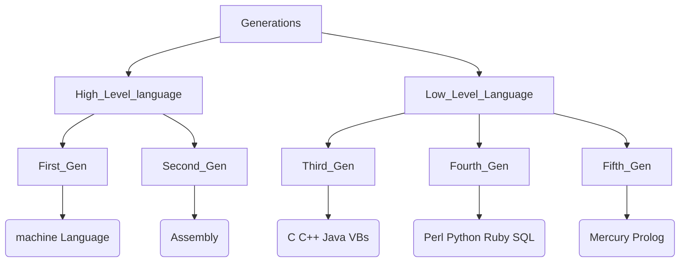

# What is Programming ?
*  Programming is a process to tell Computers what Operations to Perform.
* Sets of Instruction...
* Programming language is in the form of machine readable language.
*  English language has sets of rules and Grammar to interact with people, Same Programming language has sets of rules and syntax that we are using to interact with Computers.
*  we will Primarily focus on C Language throughout the course.
### Why So many Programming language ?
We have different programming language for different purpose. like in machine learning we use R, Python etc similarly, in Web development we use Javascript, and for backend we use SQL, So each language has their own purpose...
## Types of Programming Language

| Level  | Language |
| ------ | ------ |
| High Level | C, Pascal, Frontal |
| Low  level | Assembly, Machine Language, Hardware |

#### High Level Language 

* When i say high lvl language it mean the language are more closer to English language to read & understand...
  

#### Low Level Language 

* When i say Low lvl language it mean the language which are hard to read & understand(like 0's and 1's)...

## Programming Language Compilations 

* When we write a programming language into high lvl it convert into low level to interact with computer, the process of converting we often say Compilations.
* Compilation is a process in which our programming language convert into binary code...

* The code we are writing during the programming is known as Source Code, and this source code convert into binary code with the help of complier.
> what is Compiler ?
> Compiler is tool which convert our code into the ( 0s and 1s form) Machine language...
> First it Convert Source code into the Assembly language then the assembler convert it into the machine code

| Process of Compilation |
--------------------------
| Source Code >> Compiler >> Executable file|

| Inside Compiler|
----------
|Assembly Code **>>** Machine Code through Assembler tool|

> What is executable file ?
> Executable file can be run on the system...

### What is Program ?

* Program is Set of instruction following the rules of the chosen language.
* Without program Computers are useless. 


### Conversion of Program 
* Program is in human readable from & need to convert into machine language so computer can understand the instructions.
* Conversion of program can be done by Two ways .
    * Compile the program (Compiler).
    * Interpret the program (Interpreter) line by line.
### Computer Programming 
* Computer programming of writing, testing, debugging and maintaining the source code of computer program.
* Source Code is written in any Programming Language like C, C++, Python, JAVA, Perl, RUST etc.

## Generations of Programming Language


* Generations of language are Categorized in Low Level & High Level
* Low Level Language is having First Gen & Second Gen.
* High Level Language is having Third gen, Fourth Gen, &Fifth Gen.

## What is Algorithms ?
* Algorithms is define as the set of steps, which provides a chain of action to solve any problems.
* It is a step by step solution to a given problems.

### Steps to Create Algorithms : 
* Identify the Inputs : 
  * What datatype do we need ? 
  * How will i get the data.
  * In what format the data will be.
* Identify the outputs : 
  * What output di i need to return the user.
  * what format of output user needed.
* Identify the process :
  * How can i manipulate the data to produce meaningful result.
* Break the solution in steps : 
  * By breaking the solutions into steps we can easily understand the logic of program.

```text
Example of an algorithm to establish a telephone number.
Step1 : Dial the number.
Step2 : Phone rings on the party.
Step3 : Caller waits for the response.
Step4 : Caller party pick up the call. 
Step5 : Conversation begin b/w them. 
Step6 : After Conversation both disconnect the call. 

Example of adding two numbers.
Step1 : Start 
Step2 : Take two numbers. 
Step3 : Add those numbers.
Step4 : Print the results.
Step5 : Stop.
```
## Flow Chat
* Flow Chat is used to display the program logic with the help of diagram.
* We have different symbols for different representations.
  * Rectangle = logic
  * Parallelogram = input / output
  * Oval = start/end
  * Diamond = conditions
> Google for more :)

## Programming Methodology
* Programming methodology is a process of analyzing Complex Problems & Planning for software development for it.
#### Types of Programming Methodology 
1) Procedural Programming : Problem is broken down into procedures or blocks of code that preform one task each. all procedures taken together to form the whole program eg. C, Pascal.
2) Functional Programming : This Language is specially design to handle the symbolic computation and list of mathematical functions eg. Python, Lisp.
3) Object Oriented Programming : Object oriented programming  is the programming relies on the concept of classes and objects.
## Top Down Approach and Bottom up approach.
* In both top down and bottom up we are focus on the flow of program.
* C programming follows the top down approach whereas C++ Follow the Bottom up approach.

> Simple C program 
```C
#include<stdio.h>
int add(int a, int b);

int main(void){
  int a=10,b=20,c;
  c = add(a,b);
  printf("The Sum of a and b is : %d ",c);
  return 0;
}

int add(int a , int b){
  int sum  = a + b;
  return sum;
}
```
Here we can see that the flow of program is start from up to down the first execution will start from the main then it call the add() function the flow of program is goes up to down so we say it top down approach.
> Simple C++ Program
```CPP
#include<iostream>
using namespace std;

int add(int a , int b){
  int sum = a + b;
  return sum;
}

int main(){
  int a= 10 , b = 20 , c;
  c = add(a,b);
  cout << "The sum of a and b is : " << c ;
  return 0;
}

```
Here the flow of program is start from the bottom main() function, then it goes up to the add() function, so we say it bottom up approach.


***
>End :)

> Thanks for Reading ;). Support [@veilsec](https://sahilwep.github.io/about/) [@sahilwep](https://sahilwep.github.io/about/) 
 

> Respect Open Source {-_*}!
***