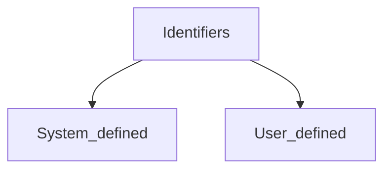
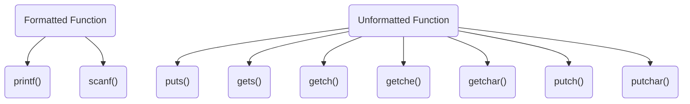

# Introduction to C Programming.

* C is Developed by Dennis Ritchie in 1970 at Bell thompson lab.
* C is High lvl, General Purpose, structured programming language.
* C contains additional feature that allows us to interact with the low level hardware.
* C allows that to used system programming as well as application programming.
## Character Set  of C
* C consist of character set, numbers, and some special symbols, the character set of c consist all english alphabets.
* C consist of 
  * Alphabets A-Z & a-z
  * Numbers 0,1-9
  * Special Symbol { } [ ] ? - + * % / ! ; : and more.

* The word formed from the character set are called building blocks and sometimes known as token.
* Token represents individual entity of language.
* Following types of tokens.
  * identifiers
  * keywords
  * constants 
  * operators
  * punctuation symbols

#### Identifiers 

* Identifiers are nothing but name given to these elements.
* Identifiers are name used by programmers to name a variable, functions or label.

#### Keywords
* Keywords are nothing but system defined identifiers.
* Keywords are reserved word are in language.
* They have specific meaning in language and cannot be used by programmer as variable and constrains.
* In C we have 32 keywords

#### Datatype 
* Datatype are define the type of data which we are using.
  * char = alphabet single character
  * int = integer
  * float = decimal
  * double = decimal with range
  * void = represent empty or absent type
```C
int a; // a is the empty variable with datatype integer.
float b;
double c;
```

#### Variables
* Variable is name given to a storage area that our programmer can manipulates.
* Each variable in C has a specific type which determines the size and layout of the memory.
* Naming of variable can be composed of letters, digits, and underscore character, it must begin with either letter or underscore.
* C is case sensitive so letter 'A' and 'a' is different because both have different ASCII value.

```C
void main(){
    char a = 'c'; // this is variable a with holding 
    int b = 10;
    float c = 10.0;
    double d  = 10.1242;
}
```

#### Constants
* Constants are value or an identifiers that cannot be change or altered in the program.
* We use Const keyword.
```C
const pi = 3.14  
```
* Integer constant are that constant that contain numeric value & it cannot be changed.

## Hello World
```C
#include <studio.h> // Global deceleration section.

int main() { 

    printf("Hello world!");
    return 0;
}
```

* This is the syntax of hello world program.
* The first line is we include the header files in the global deceleration section.
* Then we write our ```main()``` function that is int type mean it has integer type our program logic is int the **{ } curly brackets** .
* inside the main function we print the hello world **{ } curly brackets**inside the ```printf()```() function inside the **" " double quotes**.
* After every line we end the line with **; semicolon**.
* last we return 0; because we didn't want to return any thing.. we just want to print the message hello world.

## Headers Files / Library
* Headers files are those file that contains various types of functions which we use during the program development.
* Suppose we want to print some output and take some input then we need to develop the input output functions to use, so programmers are already develop the code for these work, we just need to import in our source code so that we can use.
* ```stdio.h``` contains the standard input output functions.
* ```conio.h``` contains the console input output functions, we used it in DOS Times / Turbo C, in turbo c we need this functions because in turbo c we have console CLI.
* ```math.h``` contains mathematical operations functions. 
* ```string.h``` contains functions related to string operations. 
 * We have many more different library for other uses. 

```C
#include<stdio.h>
#include<string.h>
#include<math.h>
#include<conio.h>
```
## Program Execution
* Program executes from the ```main()``` functions.
* The first functions that executes is ```main()``` functions.
* Inside the ```main()```, we write our program logic.
```C
int main(){

    // logic here
    return 0;
}
```
* At the end we write ```return 0;``` because every function return something until and unless the datatype is void, we return 0 to not effect anything on our program.

## Input / Output
* Input Output consist from the ```stdio.h``` library
  * ```printf()```() = print the output.
  * ```sacnf()```()  = takes input from the user.

```C
printf(" here message "); // print functions.
scanf("Format_Specifier", &variable_name); // output functions.

printf("Enter any no : "); // print the message.
scanf("%d",&a); // take input and store int the a variable.
```
### Format Specifier & Address Specifier
* **Format specifier** are used to specifies the type of data which we are dealing with 
  * %d  =  Integer
  * %c  =  Character
  * %f  =  float
  * %ld  =  long int
  * and many more GOOGLE..

* **Address Specifier** are used to specifies the address of the variable inside ```scanf()``` functions, we used ```&``` ampersand symbol for this.
* ampersand tells us address of variable when we used it in ```printf()``` functions.

## Datatype 
* Datatype is define as the type of date in which we are dealing.


|Type |Range| Size (in bytes)|
|----|-----|-----|
|unsigned char| 	0 to 255|  	1 | 
|signed char or char |	-128 to +127 |	1|
|unsigned int |	0 to 65535 |	2|
|signed int or int 	|-32,768 to +32767 |	2|
|unsigned short int |	0 to 65535 |	2|
|signed short int or short int |	-32,768 to +32767 |	2|
|unsigned long int |	0 to +4,294,967,295 |	4|
|signed long int or long int |	-2,147,483,648 to +2,147,483,647 |	4|
|long double |	3.4E-4932 to 1.1E+4932 |	10|
|double 	|1.7E-308 to 1.7E+308 |	8|
|float 	|3.4E-38 to 3.4E+38 |	4|

## Formatted & Unformatted Functions


#### Formatted Function : 
* Formatted function are used to take various input from user and display multiple output to user.
* These function are called formatted because we use format specifier according to their datatype.
  * %d = int
  * %c = char
  * %f = float 
  * %s = string
  * %ld = long int
  * %u = unsigned int
* functions are ```printf()``` & ```scnaf()```

#### Unformatted Function : 
* Unformatted function is only used for character datatype or character_array or  strings.
* ```getch()``` Function reads single character form the keyboard by user but doesn't display that character on screen and immediately return without pressing return key.

```C
char name[30];
getch(name); // gets  the input
```

* ```getche()``` Function reads single character form the keyboard by user and display that character on screen and immediately return without pressing return key.  

```C
char name[30];
getche(name); // gets  the input
```

* ```getchar()``` Function reads single character form the keyboard by user and display that character and  return with pressing return key.  
```C
char name[30];
getchar(name); // gets  the input
```

* ```putch()``` Function used to display single character passed by the user.

```C
char name[30] = {'s','a','h','i','l'};
putch(name); // display only s
```

* ```putchar()``` Function used to display single character passed by the user and it holds the current cursor location.  
```C
char name[30] = {'s','a','h','i','l'};
putchar(name); // display only s and cursor at s
```

* ```gets()``` Function reads the group of characters or string & store it in the character array.

```C
char name[30];
printf("Enter the name : ");
gets(name); // take the input from user.
```

* ```puts()``` Function display the group of character or string which is store in the character array.

```C
char name[30];
printf("Enter the name : ");
gets(name); // take the input from user 
puts(name); // print the output on display.
```

## Escape Sequence
* Sometime it is necessary to use some character that has some special meaning in C programming.
```C
    \t      // used for tab or 4 space
    \n      // used for enter 
    \r      // carriage return 
    \'      // escape the single quote
    \"      // escape the double quote
    \\      // escape the \ backslash
                // many more GOOGLE..
```


***
>End :)

> Thanks for Reading ;). Support [@veilsec](https://sahilwep.github.io/about/) [@sahilwep](https://sahilwep.github.io/about/) 
 

> Respect Open Source {-_*}!
***