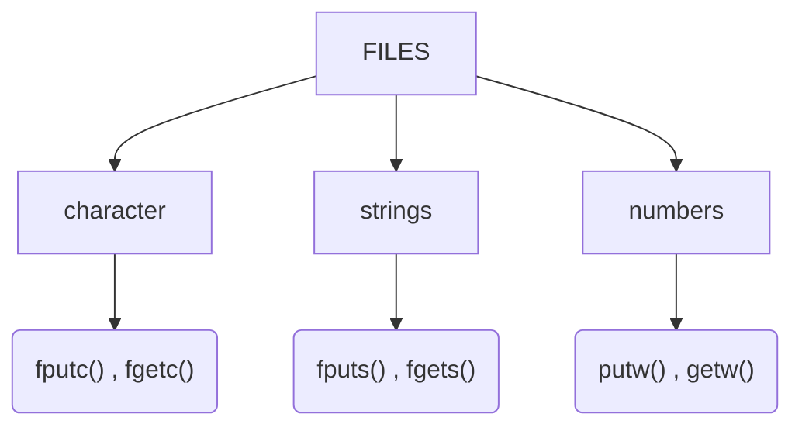

[](https://sahilwep.github.io/about/)

# Files
> **File** is a Container in Computer Storage device using for store data.

## Why Files are needed?
* When program terminated the entire data is lost. Storing in a file will preserve data even if the program is terminated.
* If we have large no of data it a lot of time to enter all of them. However if we have file containing the data we can easily access the content with few command in C.
* We can easily move data into one computer to another without any changes.

## Types Of Files
* Text File
* Binary File
### Text File :
* Text files are normal **.txt** files. we can easily create text file using simple text editor.
* Text files contain simple plain text which is easily to read. when we open the text file we can easily see the content or we can edit or delete the content.
* They are easily readable so, they don't have any Security.

### Binary Files : 
* Binary files are mostly **.bin** files. The executable files are also known as binary files.
* Binary files store data into the (0s and 1s).
* They  can hold the larger amount of data, it is not easy to read because we only have (0s and 1s).
* Binary files are safer than text files because it not easily readable.

## Operations in Files
* Creating a file pointer.
* Opening a new file.
* Closing a file.
* Reading data to a file.
* Writing data to a file.

### Creating a File Pointer :
* When we working with file, we need to declare a pointer of a file type.
* This declaration need for communication b/w files and the program.
```c
FILE *fptr;
```

### Opening a New File :
* To opening a file we are using ```fopen("location","mode")``` function which will required the location and the mode of file.
* We need to open a file in order to perform any operations in files.

```C
// syntax
fopen("address_of_file","mode_of_file");

// example 

main(){
    FILE *fptr; //  creating a file pointer.
    fptr = fopen("file.txt","r"); // open a file in write mode. 
    retrun 0;
}

```

### Closing a File :
* The (text & binary) file should be closed after reading and writing into a files.
* To Close a file we use ```fclose( FILE *fptr )``` function which will required the pointer which is associated with file.
* It is important to close a file, in order to use file next time, if we didn't close a file it will still open in the memory location.

```c
// syntax
flcose(flie_pointer_name);

// example
main(){
    FILE * fptr; // creating a file pointer
    fptr = fopen("myfile.txt","r"); //open a file into read mode
    /* codes.....
    .....*/
    flcose(fptr); // close the file pointer.
    return 0;
}
```
*** 
* Reading and writing into a file we use ```fprintf()``` & ```fsacnf()``` they are just same as the ```printf()``` & ```scanf()``` , the only difference is ```fprintf()``` & ```fscanf()``` expect a pointer to the file structure FILE.
* ```fprintf()``` & ```fsacnf()``` are the part of **stdio.h** 

### Reading a File :
* To read from a file we use ```fscanf()``` function.
* ```fsacnf()``` takes 3 parameters, 1st is the file pointer name, 2nd is the format specifier and 3rd is the variable in which are store the reading output.
* ```fscanf()``` are the formatted function.
* During reading we are using ```"r"``` mode in the ```fopen()```, to read...

```C
// syntax
fscanf(file_pointer_name,"format_specifier",variable_name);
```
```C
// example
main(){

    FILE *fptr; //creating a file pointer.
    char string[40]; // creating a variable to store string that we read.
    ptr = fopen("myfile.txt","r"); // open a file in read mode.
    fsacnf(fptr,"%s",string); // using fsacnf() to read from the file and store in string.
    printf("Content is : %s",string); // printing the output that we read.
    fclose(ptr); // closing the file.
    return 0;
}
```

### Writing a File :
* for writing into a file we use ```fprintf()``` function.
* ```fprintf()``` takes 3 parameters, 1st is the file pointer name, 2nd is the format specifier and 3rd is the variable in which our content is.
* During writing we are using ```"w"``` ```w+``` mode in the ```fopen()```, to read...

```C
// syntax
fprintf(file_pointer_name,"format_specifier",variable_name);
```
```C
main(){
    FILE *fptr; // creating the file.
    char string[80]="this is the content we want to write into the file"; // this is the content that we want to wite into the file.
    fptr = fopen("myfile.txt","w"); // opening the file.
    fprintf(fprt,"%s",string); // using the fprintf() to write the data into the file.
    fclose(fptr); // closing the file.
    return 0;
}

```
### Reading & Writing to a Binary file :
* For reading and writing into a binary file we use ```fread()``` & ```fwirte()```
* Steps are same as which we are using in previous for text files.

### Modes in File Handling
* Each mode has their own work during the FILE_I/O.
+ modes in file
  + r = read : read from the file.
  + w = write  : write into a file.
  + a = append : mean add the content into last.
  + b = binary : rb, wb, ab uses form binary file operations.

| Mode | Description  | Example |
|----|---|---|
|r|opens a text file in read only mode |```fopen("file.txt","r")```|
|w|opens a text file in write only mode |```fopen("file.txt","w")```|
|a|opens a text file in append mode |```fopen("file.txt","a")```|
|r+|opens a text file in read & write mode |```fopen("file.txt","r+")```|
|w+|opens a text file in read & write mode first it truncates the file ot zero length if it exist, otherwise it will create a new file. |```fopen("file.txt","w+")```|
|a+|opens a text file in read & write mode. it create the file if it does not exist,the reading will start from beginning but writing append to the last. |```fopen("file.txt","a+")```|
|rb|opens a binary file in read mode |```fopen("file.txt","rb")```|
|wb|opens a binary file in write mode |```fopen("file.txt","wb")```|
|ab|opens a binary file in append mode |```fopen("file.txt","ab")```|
|rb+|opens a binary file in read & write mode |```fopen("file.txt","rb+")```|
|rw+|opens a binary file in read & write mode |```fopen("file.txt","rw+")```|
|ab+|opens a binary file in read & write mode |```fopen("file.txt","ab+")```|
 


### File I/O Functions in C

* File I/O function are in C standard library.
* On failure it return EOF.
  * EOF = End of file.



#### ```fputc()```
* It is  file function which is used for writing a characters into a file. 
  * ```fputc(int c, FILE *fptr) ```

```C
int main(void){
    FILE *fptr; // creating the file pointer.
    char str="a"; // this is the value that we want to store.
    fptr=fopen("myfile","w"); // open the file.
    fputc(a,fptr); //using the fputc() to write a character into a file.
    fclose(fptr); // for closing the file pointer.
    return 0;
}

```


#### ```fgetc()```
* It is file function which is used for reading characters from file.
  * ```fgetc(FILE *fptr) ```
```C
int main(){
    FILE *fptr; // creating the file pointer.
    fptr = fopen("myfile.txt","r"); // open the file into read mode.
    char a = fgets(fptr); // reading from a file & storing it into variable a.
    printf("The content we read is : %c",a); // output the file that we read recent.
    fclose(ptr); // close the file.    
    return 0;
}
```


#### ```fputs()```
* It is file function which is used for writing null terminated string into file.
* write from a file.
  * ```int fputs(const *s,FILE *fp)``` 
  * We are using ```w``` in ```fopen()``` because we are writing the strings into the file.

```C
int main(void){
    FILE *fptr; // making file pointer.
    char str[90]="the content we are writing into the file.";
    fptr = fopen("myfile.txt","w"); //open the file in write mode.
    fputs(str,fptr); // using the fputs() to write into the file with using the variable
    fputs("we can pass the content direct into the puts() function directly.",fptr); // using the fputs() to write into the file with using the string direct write int the function inside.
    fclose(fptr); // closing the file pointer.
    return 0;
}

```


#### ```fgets()```
* It is file function which is used for reading null terminated string from file.
* reads from a file.
  * ```int fgets(const *s , int x , FILE *fp)```     
  * int x is the length of strings that we want to read..

```C
int main(){
    FILE *fptr;
    char str[30]; // make variable to store the value that we read.
    fptr = fopen("myfile.txt","r"); // open the file in read mode.
    fgets(str , 5 , fptr); // read from the file with fgets function.

    printf("the strings are : %s",str); // print the value that we read.
    fclose(fptr);   // closing the file pointer.
    return 0;
}
```


#### ```putw()```
* It is file function which is used for writing numbers into file.
* same as ```scanf()```

```C
int main(){
    FILE *fptr; // creating a file pointer.
    int num = 22; // the number which we want to write into a file.
    fptr = fopen("myfile.txt","w") // open the file in write mode.
    putw(num,fptr); // using putw() to write into a file.
    fclose(fptr); // closing the file.
    return 0;
}
```

#### ```getw()```
* It is file function which is used for reading numbers from file.
* same as ``printf()``

```C
int main(){
    FILE *fptr; // creating the file pointer.
    int store; // variable to store the reading content.
    fptr = fopen("myfile.txt","r"); // to open the file.
    store = getw(fptr); // using the getw() to get the number from the file.
    printf("The no we read from the file is : %d" , store); // print the output that we read from the file.
    fclose(fptr); // to close the file pointer.
    return 0;
}
```
### File Functions :

|Function	|Description| 	Syntax|
|------|-----|----|
|```fopen()```|	Used to open an existing file or to create a new file	| ```FILE *fopen(“file_name”, “mode”);``` |
|```fcose()```| Used to close the file pointer | ```fclose(FILE *stream)```|
|```fprintf()```|	Used to write data in existing file	| ```fprintf(FILE *stream, const char *format [, argument, ...])```|
|```fscanf()```	| Used to read data from the file| ```	fscanf(FILE *stream, const char *format [, argument, ...])```| 
|```fputc()```|	Used to write characters in a file |	```fputc(int c, FILE *stream)``` |
|```fgetc()```|	Used to read characters from a file	|```fgetc(FILE *stream)```|
|```fclose()```|	Used to close existing file|	```fclose( FILE *fp )```|
|```fseek()```|	puts the file pointer to the specified place| 	```fseek(FILE *stream, long int offset, int whence)``` |
|```fputw()```|	Used to write integral value in the file|	```fputw(int number,File *fp)```|
|```fgetw()```|	Used to read integral value from the file	|```fgetw(File *fp)```|
|```ftell()```|	It will return the current position of the file pointer in the file|	```ftell(FILE *stream)```| 
|```rewind()```|	the file pointer is set to the start of the file	|```rewind(FILE *stream)```|

***
>End :)

> Thanks for Reading ;). Support [@veilsec](https://sahilwep.github.io/about/) [@sahilwep](https://sahilwep.github.io/about/) 
 

> Respect Open Source {-_*}!
***